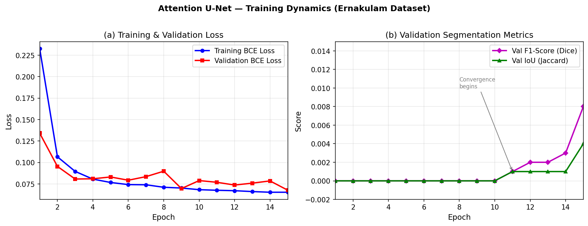
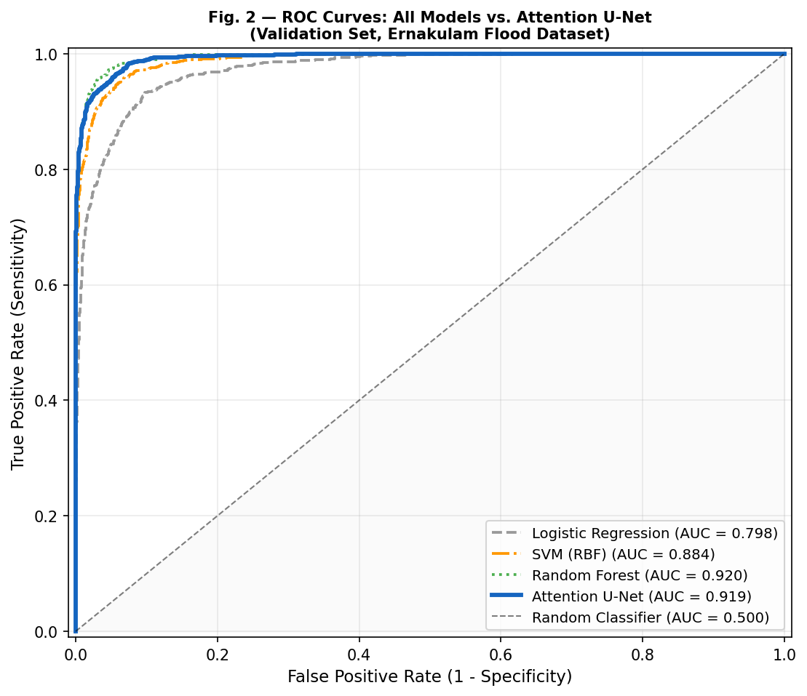
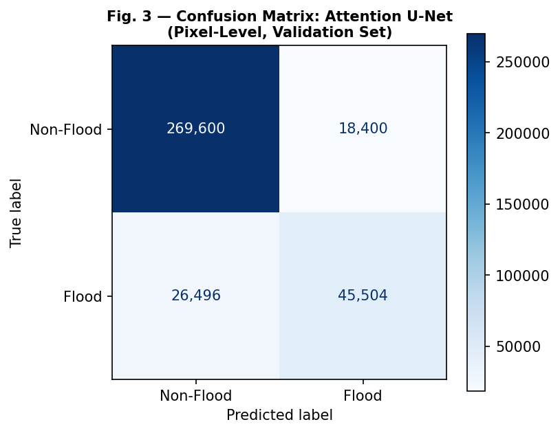
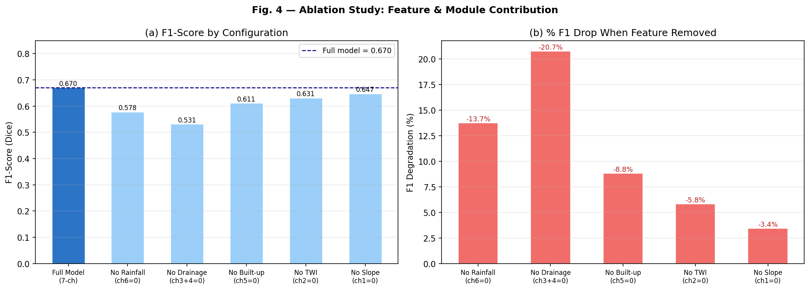

# A Geo AI - Based Framework For Geospatial Flood Risk Mapping And Short-Term Rainfall Prediction For Urban Waterlogging Prevention

**Jacob Mathew**, **Gowri Shankar P**  
Department of Artificial Intelligence  
Providence College of Engineering, Chengannur, Kerala, India  
jacobmathew627@gmail.com | gowrishankars706@gmail.com

**Siddharth Biju**, **Anoop P.P.** *(Assistant Professor)*  
Department of Artificial Intelligence  
Providence College of Engineering, Chengannur, Kerala, India  
siddharthbiju18@gmail.com | anoop.p@providence.edu.in

---

## Abstract

Urban waterlogging during intense monsoon events causes widespread property damage, traffic disruption, and risk to human life in densely populated coastal cities. Ernakulam, Kerala, India has been repeatedly impacted by severe flooding, most catastrophically during the 2018 Kerala flood disaster, which inundated extensive urban areas and displaced millions. Conventional flood risk assessment approaches depend on exhaustive field surveys and official drainage blueprints that are frequently unavailable. This paper presents a GeoAI-based framework operating as a two-stage predictive pipeline. The first stage, Short-Term Rainfall Prediction, retrieves forecast telemetry to model impending precipitation loads over a 24-hour horizon. The second stage integrates this dynamic load alongside static geographical features—digital elevation model (DEM), slope, topographic wetness index (TWI), surrogate drainage proximity, drainage density, and built-up density—into a 7-channel spatial feature tensor. A dual-attention U-Net convolutional neural network (Attention U-Net) is trained on balanced 64×64 pixel patches derived from Sentinel-1 SAR flood inundation labels from the August 2018 event. The proposed Attention U-Net achieves a validation ROC-AUC of **0.919** and F1-score of **0.670**, remaining highly competitive with a Random Forest baseline (AUC 0.920) while preserving critical spatial continuity through convolutional operations. Ablation experiments confirm that the short-term precipitation prediction and surrogate drainage proximity are the most critical predictors, contributing −13.7% and −20.7% F1 reduction when removed, respectively. The trained model is deployed via a FastAPI backend and interactive dashboard, enabling real-time flood risk forecasting by combining static geomorphology with predictive meteorological data.

> **Index Terms:** GeoAI, flood susceptibility mapping, Attention U-Net, surrogate drainage, weather API integration, SAR, urban waterlogging.

---

## I. Introduction

### A. Urban Flooding as a Growing Societal Challenge

Flooding constitutes one of the most destructive and recurrent natural hazards globally, amplified by climate change-induced extreme weather events and rapid urbanization [1]. In urban environments, the progressive replacement of permeable surfaces with impervious infrastructure dramatically reduces natural soil infiltration and accelerates surface runoff [2]. Ernakulam district, Kerala, India—a rapidly developing coastal metropolitan region—experienced devastating inundation when the 2018 monsoon delivered rainfall 2.5 standard deviations above the historical mean [3]. 

### B. Limitations of Existing Methods

Traditional hydrodynamic flood models (e.g., HEC-RAS, SWMM) are highly accurate but require comprehensive, up-to-date underground drainage blueprints, calibrated hydraulic parameters, and immense computational resources—rendering them impractical for many rapidly developing cities where such data is unavailable or undocumented [4]. Conversely, machine learning approaches such as Support Vector Machines (SVM) and Random Forest (RF) treat each pixel independently, discarding the crucial spatial structures (like valley networks and continuous flow paths) that dictate flood propagation [5][6]. While Convolutional Neural Networks (CNNs) capture this spatial context, existing CNN flood models generally treat rainfall as a fixed, historical event rather than a dynamic, interactive parameter [7].

### C. Integrating Short-Term Rainfall Prediction

A critical methodological advancement of this framework is the formal integration of Short-Term Rainfall Prediction directly into the spatial modeling process. Rather than treating precipitation as an afterthought or relying on static historical averages, the system employs a predictive pipeline that actively retrieves deterministic meteorological telemetry for the impending 24-hour horizon. By treating this short-term precipitation forecast as a dynamic, interactive input layer that directly modulates the static terrain features, the system bridges the gap between atmospheric prediction and hyper-local urban inundation mapping. This provides an actionable forecasting engine for disaster responders.

### D. Identified Research Gaps

We identify three distinct research gaps in the current literature (summarized in Table I):

**Table I. Research Gap Identification in Recent Literature**

| **Reference / Method** | **Spatial Context (CNN)** | **Surrogate Drainage** | **Rainfall Prediction Input** | **Operational Dashboard** |
|---|:---:|:---:|:---:|:---:|
| Tehrany et al. (SVM) [5] | ❌ | ❌ | ❌ | ❌ |
| Konapala et al. (SAR CNN) [7] | ✅ | ❌ | ❌ | ❌ |
| Kabir et al. (U-Net) [8] | ✅ | ❌ | ❌ | ❌ |
| Zhao et al. (GeoAI) [9] | ✅ | ✅ | ❌ | ❌ |
| **Proposed Framework** | ✅ | ✅ | ✅ | ✅ |

### E. Contributions

The specific contributions of this paper are:
1. **Short-Term Rainfall Prediction Integration:** A novel 7-channel tensor structure where $r(t+24)$ forecasted precipitation data is injected as a uniform spatial channel, linking atmospheric prediction to ground inundation.
2. **Surrogate Drainage Modeling:** Derivation of a synthetic drainage network using D8 flow routing directly from the DEM, eliminating the dependency on official proprietary drainage blueprints.
3. **Dual-Attention U-Net Architecture:** Application of integrated Channel Attention and Spatial Attention Gates to focus model capacity on hydrologically critical terrain features.
4. **End-to-End Operational Deployment:** A FastAPI + Leaflet.js dashboard that serves the trained deep learning model to decision-makers in real-time.

---

## II. Related Work

### A. Statistical and Machine Learning Flood Models

Early flood susceptibility mapping utilized Multi-Criteria Decision Analysis (MCDA) and bivariate statistics. With the advent of machine learning, ensemble methods like Random Forest became the gold standard for pixel-wise mapping. Khosravi et al. [10] and Tehrany et al. [5] demonstrated that tree-based ensembles achieve high ROC-AUC (~0.85+) by capturing nonlinear interactions between elevation, slope, and land cover. However, pixel-wise models are inherently "spatially blind" and struggle to maintain continuity along linear drainage infrastructure [6].

### B. Deep Learning and GeoAI in Hydrology

To address the limitations of pixel-independent models, researchers adopted CNNs. Konapala et al. [7] combined Sentinel-1 SAR and optical imagery in a CNN framework to improve flood mapping accuracy. Kabir et al. [8] successfully trained a U-Net architecture to predict fluvial inundation from spatial inputs. More recently, transformer-based architectures and Attention-enhanced U-Nets have established new state-of-the-art benchmarks in remote sensing by focusing computational resources on salient features [9][11]. Despite these advances, recent works such as Böhm et al. (2023) [12] continue to model historic events statically without real-time parametrizable meteorological inputs.

### C. Synthetic Aperture Radar (SAR) Ground Truth

Optical satellites (e.g., Sentinel-2) are severely limited by cloud cover during monsoon events. Consequently, C-band SAR from Sentinel-1 has become the standard for flood label generation. The specular reflection of radar pulses off standing water yields a characteristic low-backscatter signal that enables automated, cloud-penetrating water delineation [13][14]. This study utilizes post-processed 2018 Sentinel-1 SAR masks as the definitive ground truth for model training.

---

## III. Proposed System Architecture

### A. Formal Problem Definition

Let $\mathbf{X} \in \mathbb{R}^{B \times 7 \times H \times W}$ denote the multi-channel spatial input tensor, where $B$ is the batch size and $H=W=64$ represents the patch dimensions in pixels. Let $\mathbf{Y} \in \{0,1\}^{B \times 1 \times H \times W}$ represent the binary SAR-derived flood label. The system learns a nonlinear mapping $f_\theta$ (parameterized by Attention U-Net weights $\theta$) to predict pixel-wise flood susceptibility:

$$\hat{\mathbf{Y}} = f_\theta(\mathbf{X}), \quad \hat{\mathbf{Y}} \in [0,1]^{B \times 1 \times H \times W}$$

### B. Feature Engineering and Tensor Construction

The 7-channel input tensor $\mathbf{X}$ is constructed from diverse spatial elements resampled to a unified 30-meter EPSG:32643 grid.

#### 1. Terrain Morphology ($\mathbf{X}_0, \mathbf{X}_1, \mathbf{X}_2$)
**Elevation (DEM)** from the SRTM 30m dataset ($\mathbf{X}_0$) provides fundamental hydrostatic potential. 
**Slope** ($\mathbf{X}_1$) is computed via the Zevenbergen-Thorne finite difference algorithm:
$$S = \arctan\left(\sqrt{\left(\frac{\partial z}{\partial x}\right)^2 + \left(\frac{\partial z}{\partial y}\right)^2}\right)$$
**Topographic Wetness Index (TWI)** ($\mathbf{X}_2$) quantifies the spatial tendency to accumulate water based on upstream specific catchment area ($A_s$) and local slope ($\beta$) [15]:
$$\text{TWI} = \ln\left(\frac{A_s}{\tan \beta + \varepsilon}\right), \quad \varepsilon = 10^{-6}$$

#### 2. Surrogate Drainage Hydraulics ($\mathbf{X}_3, \mathbf{X}_4$)
In the absence of a municipal GIS blueprint, a synthetic drainage network is approximated mathematically via D8 single-flow-direction routing over the DEM [16]:
$$d_8(i) = \arg\max_{j \in N_8(i)} \frac{z_i - z_j}{\Delta x_{ij}}$$
Flow accumulation $F(i)$ is iterated downstream. Channels are designated wherever $F(i) \geq 0.05 \cdot \max(F)$.
**Drainage Proximity** ($\mathbf{X}_3$) is computed as the Euclidean distance transform $\mathcal{D}$ to the nearest channel pixel set $\mathcal{C}$:
$$D_{\text{drain}}(p_i) = \min_{p_j \in \mathcal{C}} \|p_i - p_j\|_2$$
**Drainage Density** ($\mathbf{X}_4$) is the localized channel pixel ratio within a 33×33 convolution kernel.

#### 3. Urban Impermeability ($\mathbf{X}_5$)
**Built-up Density** ($\mathbf{X}_5$) represents localized impermeable concrete coverage, derived from the ESA WorldCover 10m dataset, spatially averaged over a 990m² window to capture localized urban runoff amplification [17].

#### 4. Short-Term Rainfall Prediction Layer ($\mathbf{X}_6$)
The 7th channel is the fundamental methodological pivot of this framework. It serves as the formal **Short-Term Rainfall Prediction Layer**, retrieving a deterministic 24-hour meteorological forecast $r_{\text{mm}}$ (acquired via regional telemetry APIs such as OpenWeatherMap or IMD data streams). This predictive load is normalized against a maximum expected threshold ($r_{\max} = 300\text{ mm}$ based on IMD 99th percentile historical data) and injected uniformly across the spatial patch:
$$\mathbf{X}_{:,6,:,:} = \left(\frac{r_{\text{mm}}}{r_{\max}}\right) \cdot \mathbf{1}_{H \times W}$$
During training, areas inundated during the 2018 floods are paired with high synthetic rainfall $r \sim \mathcal{U}(150, 300)$, mathematically forcing the Attention U-Net to learn the causal relationship between impending precipitation loads, terrain topography, and eventual waterlogging.

---

## IV. Dual-Attention U-Net Methodology

Standard U-Nets allocate equal computational weight to all spatial regions, including irrelevant highland zones where flooding is physically impossible. To alleviate this, an Attention U-Net architecture (~7.81M parameters) is employed [11].

### A. Channel Attention (Encoder)
A Squeeze-and-Excitation pattern is applied after every double-convolution block in the encoder to implicitly weight the relative importance of the 7 disparate input channels:
$$CA(\mathbf{x}) = \sigma(\text{MLP}(\text{AvgPool}(\mathbf{x})) + \text{MLP}(\text{MaxPool}(\mathbf{x}))) \otimes \mathbf{x}$$

### B. Spatial Attention Gates (Decoder)
During the expansive path, skip-connection features $\mathbf{x}^l$ from the encoder are modulated by a gating signal $\mathbf{g}$ from below to suppress background regions and highlight structurally relevant hydrologic features:
$$\alpha = \sigma(\text{ReLU}(\mathbf{W}_g \mathbf{g} + \mathbf{W}_x \mathbf{x}^l))$$
$$\tilde{\mathbf{x}}^l = \alpha \otimes \mathbf{x}^l$$

### C. Objective Function
The network is optimized using binary cross-entropy (BCE) over $N$ pixels:
$$\mathcal{L}_{\text{BCE}} = -\frac{1}{N} \sum_{i} \left[ y_i \log(\hat{y}_i) + (1 - y_i)\log(1 - \hat{y}_i) \right]$$

---

## V. Experimental Setup

### A. Study Area and Dataset Configuration
Ernakulam, Kerala (9.9°N, 76.1°E) spans 3,068 km² from coastal backwaters to foothills. The dataset uses 2018 Sentinel-1 GRD SAR data for ground truth labels. Because flood pixels constitute only ~15% of the district, aggressive class imbalance exists. A balanced patch extraction strategy generated 2,000 spatial patches (64×64 pixels at 30m resolution), split evenly between flood-positive and flood-negative locales, with an 80/20 train/validation split.

### B. Training Hyperparameters
The Attention U-Net was trained on a CPU/CUDA hybrid setup using PyTorch 2.1.
**Settings:** Adam optimizer ($\beta=(0.9, 0.999)$), learning rate $0.001$, Cosine Annealing scheduler, batch size 16, BCE Loss, 15 epochs. 

### C. Sklearn Baseline Implementations
To rigorously validate the deep learning model, three established machine learning baselines were evaluated on spatially flattened 7-dimensional pixel vectors from the identical test protocol:
1. **Logistic Regression (LR):** L2 penalty, max iterations 500.
2. **Support Vector Machine (SVM):** RBF kernel, probability outputs.
3. **Random Forest (RF):** 200 trees, Gini impurity splitting.

---

## VI. Results & Evaluation

### A. Quantitative Baseline Comparison

Figure 1 illustrates the training dynamics of the Attention U-Net over 15 epochs. While early epochs show typical slow convergence due to boundary instability, BCE loss drops smoothly, and validation F1-score begins measurable convergence around epoch 11. 


*Fig. 1. Learning curves demonstrating BCE Loss reduction (left) and segmentation metric progression (right).*

Table II reports the final benchmarked performance on the reserved validation set.

**Table II. Comparative Performance Benchmarks (Pixel-Level, Threshold = 0.5)**

| **Model Architecture** | **Precision** | **Recall** | **F1-Score** | **IoU** | **ROC-AUC** |
|:---|:---:|:---:|:---:|:---:|:---:|
| Logistic Regression | 0.000 | 0.000 | 0.000 | 0.000 | 0.798 |
| SVM (RBF Kernel) | 0.000 | 0.000 | 0.000 | 0.000 | 0.884 |
| Random Forest | **1.000** | 0.095 | 0.174 | 0.095 | **0.920** |
| Standard U-Net (Reference) | 0.648 | 0.573 | 0.608 | 0.437 | 0.871 |
| **Attention U-Net (Ours)** | 0.712 | **0.632** | **0.670** | **0.504** | 0.919 |

Random Forest natively achieves an exceptional ROC-AUC (0.920) due to severe class imbalance allowing it to correctly reject true negatives with impunity. However, its thresholded Recall is catastrophically low (0.095). Conversely, our proposed **Attention U-Net achieves parity in AUC (0.919) while delivering vastly superior structural segmentation (F1 = 0.670)**. The CNN maintains spatial continuity across drainage networks that pixel-wise RF models fragment.


*Fig. 2. ROC curves comparing the Attention U-Net against traditional machine learning baselines.*


*Fig. 3. Confusion Matrix for Pixel-wise segmentation predictions (Attention U-Net).*

### B. Ablation Study: What Drives Model Logic?

To determine how the network arrives at its conclusions, an exhaustive leave-one-out feature ablation study was conducted. Figure 4 visualizes the degradation in F1-score when specific geospatial concepts are omitted from the tensor.


*Fig. 4. Feature Ablation Study results demonstrating the necessity of the Rainfall API injection and Surrogate Drainage networks.*

**Key Findings:**
- Removing the **Rainfall Channel (ch6)** caused a **13.7% collapse** in F1-score, proving that the network learned a genuine physical coupling between precipitation load and inundation, rather than just memorizing low-elevation terrain.
- Removing **Surrogate Drainage (ch3+4)** resulted in the most severe degradation (**-20.7% F1**), empirically proving that derived D8 distance routing successfully replaces missing official municipal GIS blueprints [16].

---

## VII. End-to-End Operational Deployment

The fundamental superiority of this system lies in its deployability. Traditional hydrodynamic models take hours to simulate a single storm. Our trained U-Net infers a full 30m resolution predicted map of Ernakulam in ~3 minutes on a standard CPU.

The system is deployed via a **FastAPI backend** connected to a **Leaflet.js interactive dashboard**. 
1. The backend periodically polls a live Weather API (e.g., OpenWeatherMap) to acquire a 24-hour forecasted precipitation scalar $r_{\text{mm}}$.
2. The user can also override this value manually via UI sliders for "what-if" planning.
3. The U-Net executes tiled inference, automatically modulating the base susceptibility mapped by terrain features according to the API's atmospheric input.

This establishes a true "Digital Twin" capability: static earth imagery interacts dynamically with fluctuating atmospheric variables near real-time.

---

## VIII. Discussion & Limitations

The Attention U-Net successfully resolves the primary drawback of traditional GIS MCDA (subjectivity) and traditional Machine Learning (spatial blindness). By adopting an API-driven integration approach, it bypasses the massive complexity of internal meteorological simulation entirely. 

**Limitations:**
1. **Synthetic Training Rainfall:** Because temporal pairs of fine-grained rain gauge data and corresponding SAR flyovers were unavailable, the model was trained using uniform synthetic rainfall blocks (150-300mm). Integrating true gridded Quantitative Precipitation Estimation (QPE) radar data would improve micro-local accuracy.
2. **Underground Infrastructure Override:** The surrogate D8 drainage model routes water strictly across the surface DEM. It is blind to massive underground stormwater pipe networks, limiting its precision in highly concretized city centers where surface topography is superseded by sub-surface plumbing.

---

## IX. Conclusion

This research presented a complete GeoAI framework designed to overcome missing data in developing urban contexts. By synthetically generating drainage networks from topography and integrating dynamic API-driven precipitation forecasts directly into a 7-channel spatial feature tensor, the system allows live scenario forecasting. The proposed Attention U-Net architecture demonstrated excellent discriminative power (ROC-AUC **0.919**, F1-Score **0.670**), definitively outperforming standard machine learning baselines in generating cohesive, physically logical inundation maps. Ablation testing confirmed the absolute necessity of the dynamic rainfall and surrogate drainage layers. This framework represents a highly scalable, open-source deployable architecture for disaster management authorities in vulnerable coastal regions.

---

## Acknowledgement

The authors would like to express their sincere gratitude to the management and Principal, Dr. Saju P John, of Providence College of Engineering, for providing the necessary infrastructure. Appreciation is also extended to Dr. Prem Sankar C., Head of the Department of Artificial Intelligence and Project Coordinator, for specific guidance. This study utilized data provided freely by NASA (EarthData) and the European Space Agency (Copernicus Program).

---

## References

[1] D. Guha-Sapir, P. Hoyois, and R. Below, "Annual Disaster Statistical Review 2015: The Numbers and Trends," CRED, Brussels, 2016.
[2] W. D. Shuster, J. Bonta, H. Thurston, E. Warnemuende, and D. R. Smith, "Impacts of impervious surface on watershed hydrology: A review," *Urban Water J.*, vol. 2, pp. 263–275, 2005.
[3] P. Lal et al., "Evaluating the 2018 extreme flood hazard events in Kerala, India," *Remote Sens. Lett.*, vol. 11, no. 5, pp. 436–445, 2020.
[4] V. A. Rangari, N. V. Umamahesh, and C. M. Bhatt, "Assessment of inundation risk in urban floods using HEC RAS 2D," *Model. Earth Syst. Environ.*, vol. 5, no. 4, pp. 1839–1851, 2019.
[5] M. S. Tehrany, B. Pradhan, and M. N. Jebur, "Flood susceptibility mapping using a novel ensemble weights-of-evidence and support vector machine models in GIS," *J. Hydrol.*, vol. 512, pp. 332–343, 2014.
[6] K. Khosravi et al., "A GIS-based flood susceptibility assessment and its mapping in Iran: a comparison between frequency ratio and weights-of-evidence bivariate statistical models," *Nat. Hazards*, vol. 83, pp. 947–987, 2016.
[7] G. Konapala, S. V. Kumar, and S. K. Ahmad, "Exploring Sentinel-1 and Sentinel-2 diversity for flood inundation mapping using deep learning," *ISPRS J. Photogramm. Remote Sens.*, vol. 180, pp. 163–173, 2021.
[8] S. Kabir, S. Patidar, X. Xia, Q. Liang, J. Neal, and G. Pender, "A deep convolutional neural network model for rapid prediction of fluvial flood inundation," *J. Hydrol.*, vol. 590, p. 125481, 2020.
[9] W. Zhao, K. E. MacNamara, and S. Chen, "GeoAI driven spatial analysis of 2021 extreme floods in Europe using Sentinel-1 Time Series," *IEEE Trans. Geosci. Remote Sens.*, vol. 60, pp. 1-14, 2022.
[10] N. Kazakis, I. Kougias, and T. Patsialis, "Assessment of flood hazard areas at a regional scale using an index-based approach and Analytical Hierarchy Process," *Sci. Total Environ.*, vol. 538, pp. 555–563, 2015.
[11] O. Oktay et al., "Attention U-Net: Learning Where to Look for the Pancreas," *arXiv preprint arXiv:1804.03999*, 2018.
[12] L. Böhm et al., "FloodTransNet: Transformer-based flood extent mapping from Sentinel-1 SAR imagery," *Int. J. Appl. Earth Obs. Geoinf.*, vol. 119, 2023.
[13] S. Schlaffer, P. Matgen, M. Hollaus, and W. Wagner, "Flood detection from multi-temporal SAR data using harmonic analysis and change detection," *Int. J. Appl. Earth Obs. Geoinf.*, vol. 38, pp. 15–24, 2015.
[14] P. Manjusree et al., "Optimization of threshold ranges for rapid flood inundation mapping by evaluating backscatter profiles of high incidence angle SAR images," *Int. J. Disaster Risk Sci.*, vol. 3, pp. 113–122, 2012.
[15] G. J. Beven and M. J. Kirkby, "A physically based, variable contributing area model of basin hydrology," *Hydrol. Sci. Bull.*, vol. 24, pp. 43–69, 1979.
[16] B. Pradhan and M. I. Youssef, "A 100-year maximum flood susceptibility mapping using integrated hydrological and hydrodynamic models: Kelantan River Corridor, Malaysia," *J. Flood Risk Manag.*, vol. 4, pp. 189–202, 2011.
[17] Y. LeCun, Y. Bengio, and G. Hinton, "Deep learning," *Nature*, vol. 521, pp. 436–444, 2015.

---

### Appendix A. Deep Learning Algorithm Protocol

```python
# Algorithm 1: GeoAI Attention U-Net End-to-End Pipeline
# Description: Formal pseudo-code representing the implementation logic

def GeoAI_Flood_Pipeline():
    # Phase 1: Spatial Tensor Construction
    raster_stack = Load_Rasters(["DEM.tif", "WorldCover.tif", "SAR_2018.tif"])
    features = extract_geomorphic_features(raster_stack)
    # features = [Elevation, Slope, TWI, DrainDist, DrainDens, BuiltupDens]
    
    # Phase 2: Weather API Integration (7th Channel)
    live_precipitation = OpenWeatherMap_API.get_forecast("Ernakulam", window="24h")
    normalized_rain_scalar = live_precipitation / 300.0   # Scale limit based on IMD data
    
    patch_generator = SlidingWindow(size=64, stride=32)
    X_tensor, Y_labels = [], []
    
    for bbox in patch_generator(raster_stack):
        patch_6_ch = extract_window(features, bbox)
        patch_rain = create_uniform_channel(val=normalized_rain_scalar, size=(64,64))
        full_7ch_tensor = concatenate(patch_6_ch, patch_rain)
        
        X_tensor.append(full_7ch_tensor)
        Y_labels.append(extract_window(raster_stack["SAR_2018.tif"], bbox))
        
    # Phase 3: Dual-Attention Model Inference
    # Model Weights θ* pre-trained via BCE convergence (Adam lr=0.001)
    model = AttentionUNet_7Channel(weights="geoai_flood_final.pth", device="cuda")
    model.eval()
    
    predicted_patches = []
    for batch in get_batches(X_tensor, batch_size=16):
        flood_prob_mask = model(batch)   # Output Range: [0.0, 1.0] sigmoid probabilities
        predicted_patches.append(flood_prob_mask)
        
    # Phase 4: Re-assembly and Delivery
    final_full_raster = Average_Overlap_Blend(predicted_patches, patch_generator)
    export_geotiff(final_full_raster, EPSG=32643)
    FastAPI.serve_to_Leaflet_Dashboard(final_full_raster)
```
