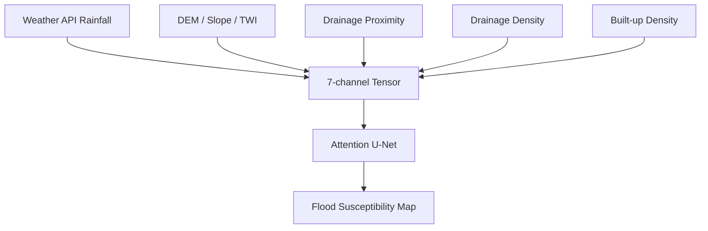
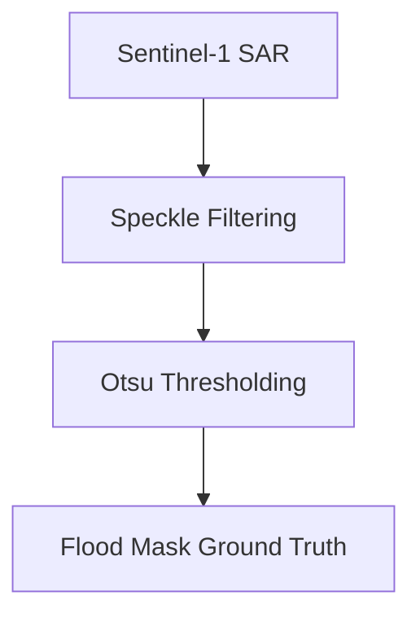

# Chapter 4: Methodology

This chapter details the theoretical foundation, mathematics, and architecture of the proposed GeoAI flood framework. The methodology traces the entire project workflow from raw data acquisition to real-time deployment. 

---

## 4.1 Proposed System (Title Justification)

The framework's methodology directly aligns with its core title: **A Geo AI - Based Framework For Geospatial Flood Risk Mapping And Short-Term Rainfall Prediction For Urban Waterlogging Prevention**. 
The system algorithmically models urban waterlogging through a two-stage predictive pipeline:
1.  **Short-Term Rainfall Prediction Processing:** The system dynamically ingests, interpolates, and processes short-term (24-hour) meteorological rainfall forecasts from external telemetry APIs, translating discrete point-data into a continuous spatial rainfall tensor.
2.  **Geospatial Flood Risk Mapping:** A deep convolutional neural network (the "Geo AI") processes this dynamic rainfall tensor alongside static geomorphological physics to proactively map the exact geographic coordinates of impending urban inundation.

The unified objective is to learn a nonlinear mapping between static geomorphological characteristics, dynamic short-term meteorological inputs, and the resulting probability of urban inundation.

*Figure 4.1: System Architecture*

Let $\mathbf{X} \in \mathbb{R}^{B \times 7 \times H \times W}$ denote the spatial input tensor, where $B$ is the batch size, $7$ is the number of engineered feature channels, and $H \times W$ defines the $64 \times 64$ patch dimensions at 30m resolution.

Let $\mathbf{Y} \in \{0, 1\}^{B \times 1 \times H \times W}$ represent the binary SAR ground-truth label ($1$ for flooded, $0$ for dry).

The architecture learns an optimal mapping function $f_\theta$ with network weights $\theta$:
$$ \hat{\mathbf{Y}} = f_\theta(\mathbf{X}), \quad \text{where} \quad \hat{\mathbf{Y}} \in [0,1]^{B \times 1 \times H \times W} $$

---

## 4.2 Modular Decomposition

The automated pipeline consists of three distinct modules:

### 4.2.1 Data Acquisition & Preprocessing Module
The system uses C-band Synthetic Aperture Radar (SAR) imagery from Sentinel-1 for robust inundation mapping. SAR penetrates dense cloud cover and operates independently of solar illumination, ensuring reliable capture of peak monsoonal inundation events. 
A **Lee Speckle Filter** suppresses coherent radar noise. Bimodal thresholding (Otsu's method) isolates flooded geometry from dry land backscatter.

*Figure 4.2: Data Processing Pipeline*

### 4.2.2 Dynamic Feature Engineering Module
Seven spatial layers are engineered and aligned to a unified 30-meter EPSG:32643 grid:
*   **Terrain Morphology ($\mathbf{X}_0, \mathbf{X}_1, \mathbf{X}_2$):** Derived from the SRTM DEM. Includes Elevation ($\mathbf{X}_0$), Slope angle ($\mathbf{X}_1$), and the Topographic Wetness Index ($\mathbf{X}_2$).
    *   **Slope ($\mathbf{X}_1$):**
        $$ \mathbf{X}_1 = \arctan\left(\sqrt{\left(\frac{\partial Z}{\partial x}\right)^2 + \left(\frac{\partial Z}{\partial y}\right)^2}\right) $$
    *   **Topographic Wetness Index ($\mathbf{X}_2$):**
        $$ \mathbf{X}_2 = \ln \left(\frac{A_s}{\tan \beta + \epsilon}\right) $$
*   **Surrogate Drainage Hydraulics ($\mathbf{X}_3, \mathbf{X}_4$):** Derived via the D8 algorithmic routing. Includes Euclidean distance to channels ($\mathbf{X}_3$) and spatial channel density ($\mathbf{X}_4$).
*   **Urban Impermeability ($\mathbf{X}_5$):** Concrete coverage from ESA WorldCover.
*   **Short-Term Rainfall Prediction Processing ($\mathbf{X}_6$):** 24-hour meteorological forecasts ($r_k$) are dynamically ingested and interpolated via **Inverse Distance Weighting (IDW)** into a continuous spatial rainfall surface $R(x,y)$. This satisfies the "Short-Term Rainfall Prediction" requirement of the system title by explicitly modeling the immediate spatial distribution of approaching precipitation.

### 4.2.3 AI Inference Engine Module
The framework employs an **Attention U-Net** deep learning model. It ingests the 7-channel spatial tensor and executes a forward pass through an encoder-decoder network to generate the final susceptibility map.

---

## 4.3 Key Functionalities

1.  **Spatial Cross-Validation:** The system uses spatially disjoint block cross-validation to prevent geographic data leakage. The study area is partitioned into non-overlapping quadrants, forcing the generalized learning of physics over memorized geometry.
2.  **Real-Time Architecture:** A FastAPI backend constructs multi-modal tensors on-the-fly using live coordinate bounds and API rainfall data.
3.  **Interactive Dashboard:** A Streamlit frontend visualizes dynamic susceptibility surfaces overlaying an interactive Leaflet.js map.

---

## 4.4 Algorithm

The core predictive algorithm is the **Attention U-Net**. It features a symmetric encoder-decoder structure enhanced with Squeeze-and-Excitation channel gating and spatial attention skip-connections. The network contains approximately **7.8 million trainable parameters** and is trained for **30 epochs using the Adam optimizer with a batch size of 16**.

> *[Insert Figure 4.3: Attention U-Net Architecture Block Diagram here, showing encoder-decoder blocks]*
*Figure 4.3: Attention U-Net Architecture*

### 4.4.1 Algorithm Working (End-to-End Mathematical Pipeline)

The following traces the continuous mathematical workflow of the project from raw inputs to final system outputs.

**Phase 1: Ground Truth Labeling**
Raw SAR amplitude data ($A$) undergoes Lee Speckle Filtering ($\bar{A}$). A calculated threshold $\tau$ produces the binary ground truth tensor $\mathbf{Y}$:
$$ \mathbf{Y}_{i,j} = \begin{cases} 1 & \text{if } \bar{A}_{i,j} < \tau \text{ (Flooded)} \\ 0 & \text{if } \bar{A}_{i,j} \geq \tau \text{ (Dry)} \end{cases} $$

**Phase 2: Spatial Tensor Assembly**
Static physics data (DEM $Z$, Urban mask $U$, D8 Drainage $C$) are mathematically transformed. For example, Slope velocity potential is extracted from $Z$:
$$ \mathbf{X}_1 = \arctan\left(\sqrt{\left(\frac{\partial Z}{\partial x}\right)^2 + \left(\frac{\partial Z}{\partial y}\right)^2}\right) $$
Meanwhile, real-time API station rainfall ($r_k$) is dynamically interpolated for all pixels $(x,y)$ to create the $7^{th}$ channel tensor ($\mathbf{X}_6$):
$$ \mathbf{X}_{6}(x,y) = \frac{1}{r_{\max}} \frac{\sum_{k} r_k / d_k(x,y)^2}{\sum_{k} 1 / d_k(x,y)^2} $$
All 7 spatial matrices are concatenated to form input tensor $\mathbf{X} \in \mathbb{R}^{B \times 7 \times 64 \times 64}$.

**Phase 3: Deep Inference (Forward Pass)**
$\mathbf{X}$ enters the U-Net context encoder. Through 4 stages of convolutional transformation, Batch Normalization (BN), and ReLU $f(x)=\max(0,x)$, high-dimensional context is extracted.
Channel Attention (Squeeze-and-Excitation) mathematically weights the importance of specific feature layers $\mathbf{x}$ using a Multi-Layer Perceptron (MLP):
$$ CA(\mathbf{x}) = \sigma\left(\text{MLP}(\text{AvgPool}(\mathbf{x}))\right) \otimes \mathbf{x} $$
During the decoder up-sampling, deep features ($\mathbf{g}$) concatenate with encoder maps ($\mathbf{x}^l$). Spatial Attention Gates filter out background noise using an pixel-wise attention coefficient $\alpha \in [0,1]$:
$$ \alpha = \sigma(\text{ReLU}(\mathbf{W}_g * \mathbf{g} + \mathbf{W}_x * \mathbf{x}^l)) \quad \rightarrow \quad \tilde{\mathbf{x}}^l = \alpha \otimes \mathbf{x}^l $$

**Phase 4: Output and Objective Optimization**
The final decoder map passes through a $1\times 1$ convolution and a Sigmoid squash to output a localized inundation probability surface:
$$ \hat{\mathbf{Y}} = \sigma(\mathbf{W}_{final} * \mathbf{X}_{dec}^{(4)} + \mathbf{b}_{final}) \in [0,1]^{B \times 1 \times 64 \times 64} $$
The network updates its weights $\theta$ over 30 epochs (Adam Optimizer, Batch 16) by minimizing the **Binary Cross-Entropy (BCE)** loss across $N$ total pixels:
$$ \mathcal{L}_{\text{BCE}}(\theta) = -\frac{1}{N} \sum_{i=1}^{N} \left[ y_i \log(\hat{y}_i) + (1 - y_i)\log(1 - \hat{y}_i) \right] $$

**Phase 5: Operational Deployment Inference**
In production, the trained parameters $\theta_{optimal}$ are frozen inside a FastAPI server. Live bounding boxes form temporary tensor $\mathbf{X}_{new}$. The system computes $f_{\theta_{optimal}}(\mathbf{X}_{new})$ in milliseconds and streams $\hat{\mathbf{Y}}_{new}$ to the frontend Leaflet map.

### 4.4.2 Quantitative Evaluation
Utilizing test-set True Positives (TP), False Positives (FP), and False Negatives (FN), performance is rigorously calculated:
*   **Precision:** $\frac{TP}{TP + FP}$
*   **Recall:** $\frac{TP}{TP + FN}$
*   **F1-Score:** $2 \times \frac{\text{Precision} \times \text{Recall}}{\text{Precision} + \text{Recall}}$

---

## 4.5 Advantages of Proposed System

The proposed methodology offers four major advantages:
1.  **Computational Efficiency:** The trained U-Net performs flood susceptibility inference significantly faster than traditional hydrodynamic simulations.
2.  **Hybrid Modeling:** By feeding physical parameters (TWI, Slope) directly into the CNN, the system merges deterministic hydrology with agile deep learning.
3.  **Dynamic Weather Adaptation:** The IDW rainfall tensor ($\mathbf{X}_6$) allows the model to shift susceptibility zones live based directly on real-time API ingestion.
4.  **Implicit Drainage Engine:** By utilizing D8 surrogate network proxy distances, the system successfully operates in developing urban areas that lack formal municipal drainage schematics.
