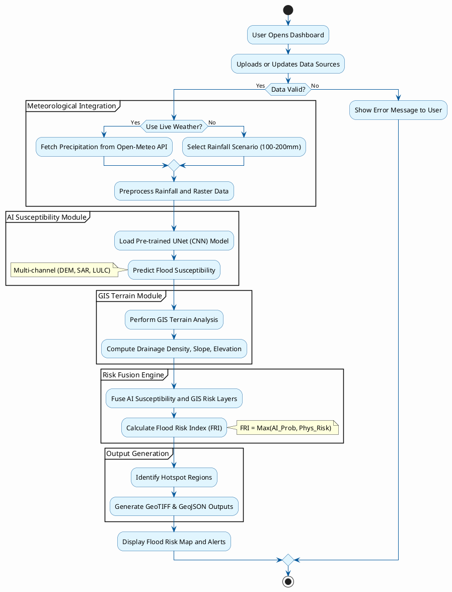
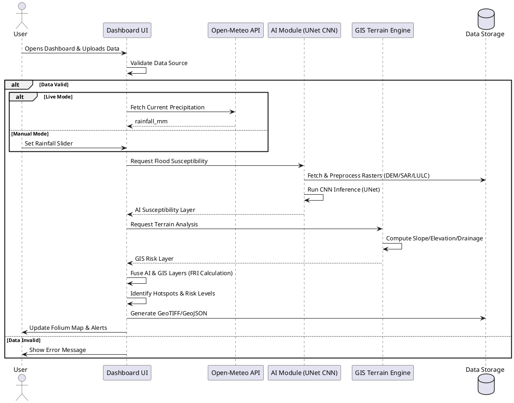
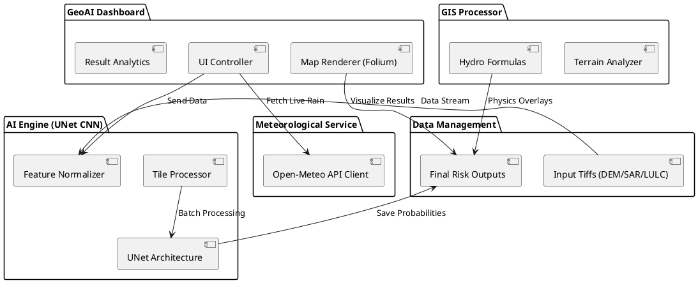

# GeoAI Flood Project - Architecture & Flow Diagrams

This document contains PlantUML code for visualizing the project's logic and architecture, strictly following the system workflow using the actual **Hybrid CNN (UNet)** architecture and **Live Weather API** integration.

## 1. Refined Activity Diagram
This diagram shows the complete workflow from data ingestion to final flood risk visualization and hotspot generation, accurately reflecting the CNN-based processing and API-driven meteorology.

## 2. Sequence Diagram
Highlights the interaction between the User, Dashboard, AI Engine (CNN), and GIS Processor.

## 3. Component Diagram
Structural view of the system's modular architecture using the UNet CNN engine and Open-Meteo integration.

